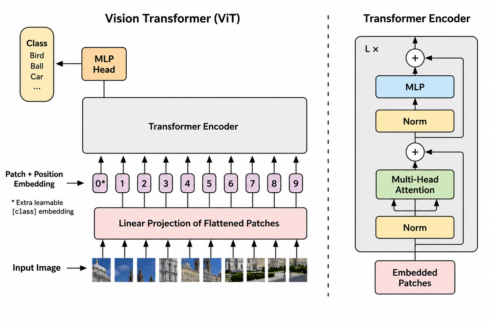
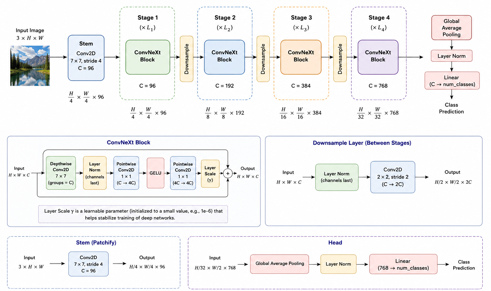
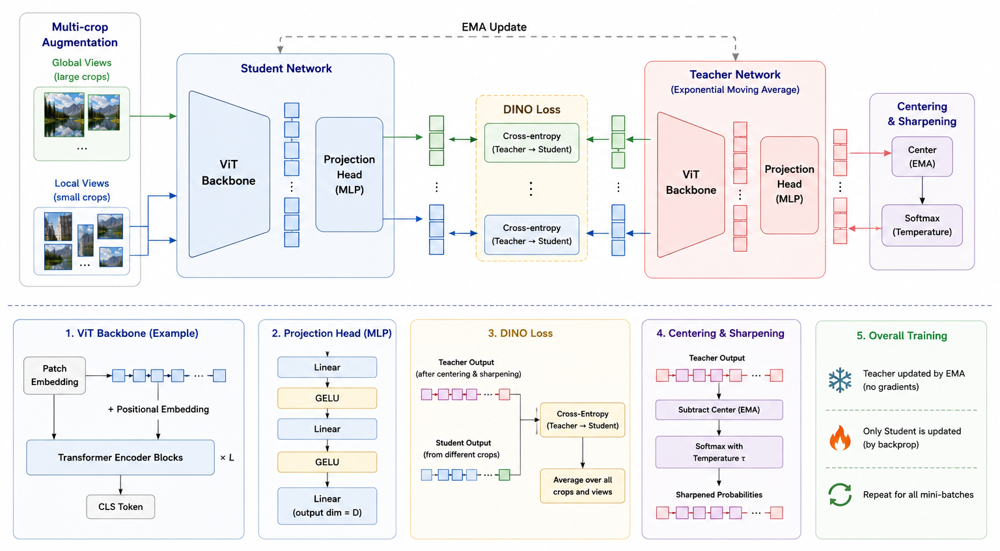

# Vision Models from Scratch for Representation Learning

A collection of modern computer vision architectures implemented from scratch in PyTorch, focused on image classification, feature extraction, and representation learning.

This repository contains four independent projects:

1. Vision Transformer on CIFAR-100
2. Swin Transformer on CIFAR-100
3. ConvNeXt on Tiny ImageNet
4. Mini-DINOv2-style self-supervised model on STL-10

The goal of this repository is to provide clean, educational, and research-friendly implementations of important vision backbones. Each model is organized as a separate project with its own training scripts, evaluation scripts, plotting utilities, and detailed README.

---

## Repository Overview

```text
vision-transformers-representation-learning/
├── README.md
├── 
├── convnext-tinyimagenet-representation-learning/
├── minidino-stl10-representation-learning/
├── swin-cifar100-representation-learning/
├── vit-cifar100-from-scratch/
├── assets/
│   ├── architecture_vit.png
│   ├── architecture_swin.png
│   ├── architecture_convnext.png
│   └── architecture_dino.png
```

---

## Models Included

| Model                   | Dataset                       | Learning Type                        | Main Focus                                                                      |
| ----------------------- | ----------------------------- | ------------------------------------ | ------------------------------------------------------------------------------- |
| Vision Transformer      | CIFAR-100                     | Supervised learning                  | Patch embeddings, transformer encoder, classification, feature extraction       |
| Swin Transformer        | CIFAR-100                     | Supervised + representation learning | Shifted window attention, hierarchical vision transformer, feature extraction   |
| ConvNeXt                | Tiny ImageNet                 | Supervised + contrastive learning    | Modern convolutional backbone, stage-wise features, linear probing              |
| Mini-DINOv2-style Model | STL-10 unlabeled + train/test | Self-supervised learning             | Student-teacher training, multi-crop views, frozen features, k-NN, linear probe |

---

# 1. Vision Transformer from Scratch on CIFAR-100

The Vision Transformer project implements a ViT model from scratch for CIFAR-100 classification.

## Key Components

* Patch embedding
* Learnable class token
* Positional embeddings
* Multi-head self-attention
* Transformer encoder blocks
* MLP classification head
* Training and validation curves
* Confusion matrix
* Per-class accuracy
* Feature extraction

## Dataset

CIFAR-100 contains 100 image classes with small RGB images of size 32 × 32.

---

# 2. Swin Transformer from Scratch on CIFAR-100

The Swin Transformer project implements a hierarchical transformer using shifted-window self-attention. It is designed for both classification and representation learning.

## Key Components

* Patch embedding
* Window-based multi-head self-attention
* Shifted-window attention
* Patch merging
* Hierarchical transformer stages
* Classification head
* Supervised contrastive training
* Feature extraction
* PCA visualization
* Linear probing

## Dataset

This project uses CIFAR-100 for supervised classification and representation learning.

---

# 3. ConvNeXt from Scratch on Tiny ImageNet

The ConvNeXt project implements a modern convolutional neural network inspired by transformer-era design principles. It is trained on Tiny ImageNet for classification and representation learning.

## Key Components

* ConvNeXt stem
* Depthwise convolution
* LayerNorm
* Pointwise MLP-style convolution layers
* GELU activation
* LayerScale
* Residual connections
* Stage-wise downsampling
* Supervised classification
* Supervised contrastive learning
* Feature extraction
* Linear probing
* PCA embedding visualization

## Dataset

Tiny ImageNet contains 200 classes with 64 × 64 RGB images.

---

# 4. Mini-DINOv2-Style Self-Supervised Model on STL-10

The Mini-DINOv2-style project implements an educational self-supervised student-teacher training pipeline inspired by DINO and DINOv2-style representation learning.

This implementation is designed for learning and experimentation. It does not reproduce the full-scale DINOv2 training recipe, but it includes the core ideas needed to understand self-supervised visual representation learning.

## Key Components

* Vision Transformer backbone from scratch
* Optional register tokens
* DINO projection head
* Multi-crop augmentation
* Student network
* Teacher network
* Exponential moving average teacher update
* Centering and sharpening
* Self-distillation loss
* Feature extraction
* k-NN evaluation
* Frozen-backbone linear probing
* PCA visualization

## Dataset

This project uses STL-10:

* `unlabeled` split for self-supervised pretraining
* `train` split for linear probing
* `test` split for evaluation

---

## Installation

Each project contains its own `requirements.txt`. A common environment can also be created from the root of the repository.

```bash
python -m venv .venv
source .venv/bin/activate

pip install torch torchvision numpy matplotlib pillow tqdm
```

For CUDA-enabled training, install the PyTorch version that matches your CUDA version from the official PyTorch installation page.

---

## Common Workflow

Most projects follow this workflow:

```text
1. Prepare or download dataset
2. Visualize dataset samples
3. Train model
4. Evaluate model
5. Extract features
6. Visualize learned embeddings
7. Run linear probe or k-NN evaluation
8. Save plots and metrics
```

---

## Architecture Diagrams

Architecture diagrams can be placed inside the `assets/` directory:

```text
assets/
├── ConvNext.png
├── Mini-dino.png
├── Swin Trasnsfer.png
└── ViT.png
```

<p align="center">
  
  <br>
  <b>ViT Architecture</b>
</p>

<p align="center">
  
  <br>
  <b>Swin Transformer Architecture</b>
</p>

<p align="center">
  
  <br>
  <b>ConvNeXt Architecture</b>
</p>

<p align="center">
  
  <br>
  <b>Mini-DINO Architecture</b>
</p>


---

## Recommended Order to Study

For better understanding, study the models in this order:

1. Vision Transformer
2. Swin Transformer
3. ConvNeXt
4. Mini-DINOv2-style self-supervised model

This order moves from a basic transformer image classifier to hierarchical transformers, modern convolutional networks, and finally self-supervised representation learning.

---

## Learning Objectives

By working through this repository, you will learn:

* How patch embeddings work in vision transformers
* How multi-head self-attention is applied to images
* How Swin Transformer uses local windows and shifted windows
* How ConvNeXt modernizes convolutional neural networks
* How self-supervised student-teacher learning works
* How to extract visual features from trained backbones
* How to evaluate representations using k-NN and linear probing
* How to visualize learned embeddings using PCA
* How to organize deep learning experiments for GitHub

---

## Disclaimer

These implementations are designed for education, experimentation, and portfolio projects. They are intentionally written to be readable and modular.

The models are implemented from scratch where possible, but the datasets, image transforms, PyTorch training utilities, and standard tensor operations use PyTorch and torchvision.

The Mini-DINOv2-style project is inspired by DINO-style self-supervised representation learning, but it is not an official DINOv2 reproduction.

---

## License
MIT

This project is intended for educational and research use. Add your preferred license file, such as MIT License, before publishing the repository.
